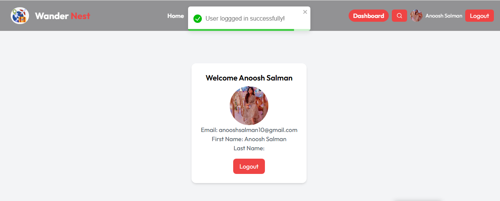
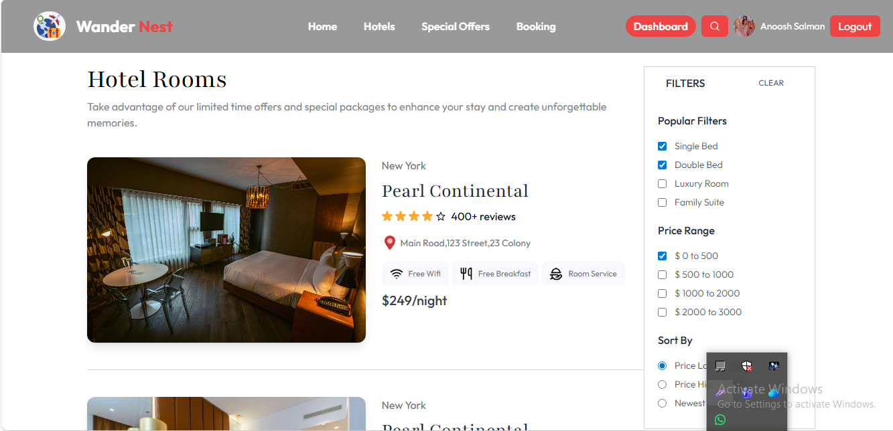
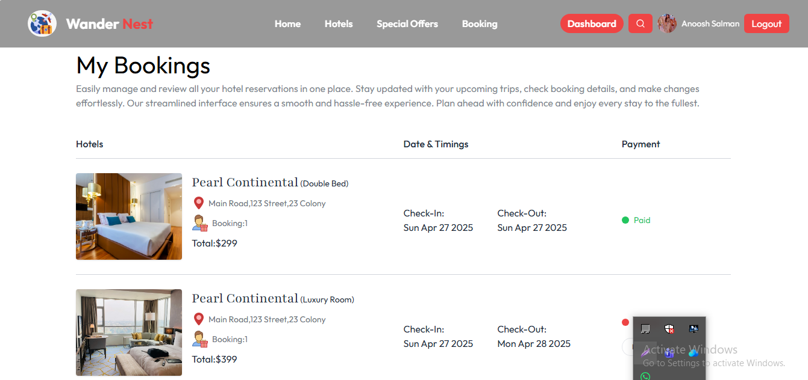

#  Hotel Booking Web App

A modern and responsive hotel booking web application built using React.  
Users can explore rooms, apply filters, view details, and securely access protected features with Firebase Authentication. Owners can see their own dashboard and manage hotel booking list.

---

##  Features

-  **Authentication (Firebase)**
  - Sign up / Login
  - Google Sign-In
  - Protected routes (only logged-in users can access certain pages)

-  **Hotel Listings**
  - Browse available rooms
  - View hotel details page

-  **Advanced Filtering**
  - Filter by room type
  - Filter by price range
  - Sort by price (low → high / high → low)

-  **Room Details Page**
  - Image gallery
  - Amenities display
  - Pricing per night

-  **Booking UI (Frontend)**
  - Select check-in / check-out dates
  - Enter number of guests

-  **Special Offers Page**
  - Show discounted deals (UI-based)

-  **User Profile**
  - Displays user data from Firebase
  - Logout functionality

-  **Responsive Design**
  - Works across mobile, tablet, and desktop

---

##  Tech Stack

- **Frontend:** React.js, JavaScript (ES6+)
- **Styling:** Tailwind CSS
- **Routing:** React Router DOM
- **Authentication:** Firebase Auth (Email + Google)
- **Database:** Firebase Firestore
- **Deployment:** Vercel / Netlify

---

## Firebase Setup
- Create a Firebase project
- Enable Authentication (Email/Password + Google)
- Create Firestore Database
- Add your Firebase config in Firebase.jsx

## Future Improvements
- Integrate real backend APIs (replace dummy data)
- Implement real booking system
- Add payment integration
- Add admin dashboard for managing rooms
- Improve performance and caching

## Key Learnings
- Implemented protected routes using authentication
- Managed state and filtering logic in React
- Worked with Firebase Authentication and Firestore
- Built a scalable UI structure for future backend integration

##  Screenshots

###  Home Page

###  Hotel Details

###  Filters

###  Bookings

## Author
- ANOOSH SALMAN